footer: Getting AMPed - David Darke | [atomicsmash.co.uk](https://www.atomicsmash.co.uk)
slidenumbers: true

## Getting AMPed ⚡️⚡️⚡️

## An intro to Accelerated Mobile Pages

---

---

---

# [fit] What's wrong with
# [fit] current mobile browsing? 🤷‍♂️

---

Mobile stats 📱[^1]

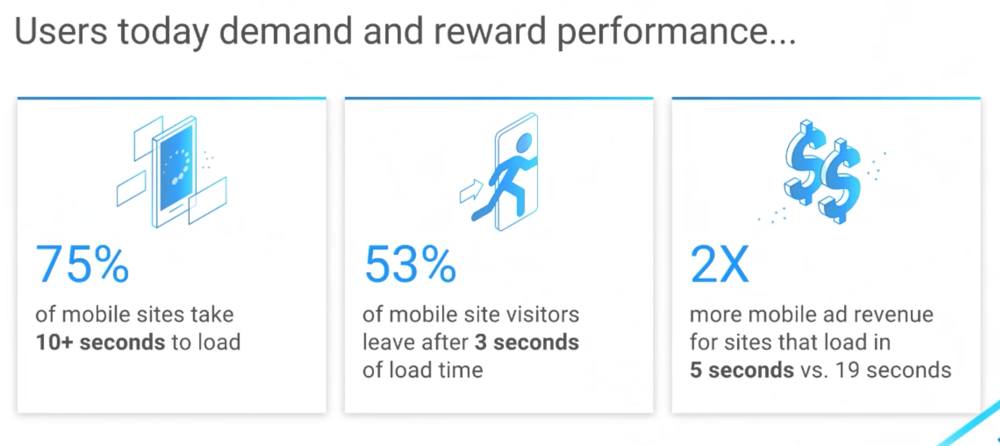

---

# [fit] Is AMP the solution? ⚡️
# [fit] Wait... What is AMP? 🏎💨

---

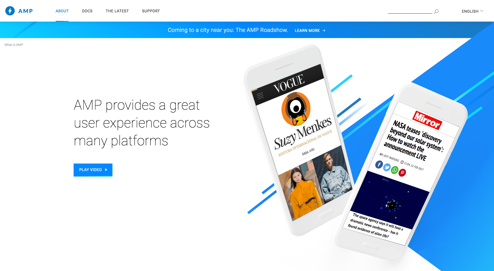

---

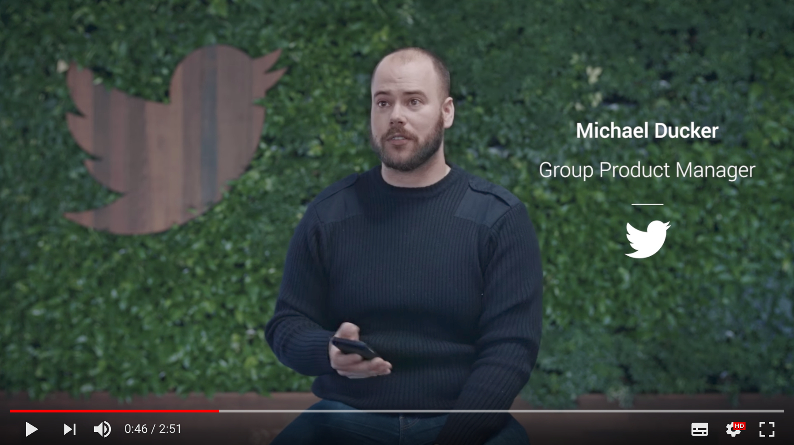

# [fit] "AMP is a fantastic industry collaborative
# [fit] approach to make mobile web faster"[^1]

---

---

---

---

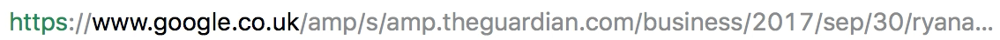

---

## Initial thoughts 🤔

Pros |
:-----------: |
**SUPER** Fast loading |
Smooth scrolling |
Reduced page 'jumping' while assets load |
You **may** gain a bit of Google goodwill |
**Apparently** it's not hard to get started |
Google is paying for your AMP traffic |

---

## Initial thoughts 🤔

Cons |
:-----------: |
Limited technology |
Different UX to Desktop |
It is just for mobile devices (obviously) |
Google is paying for your AMP traffic |

---

# [fit] Time to try it!
# [fit] What we did to setup AMP ⚙️

---

# [fit] Step 1
# [fit] Get the AMP plugin 🔌

---

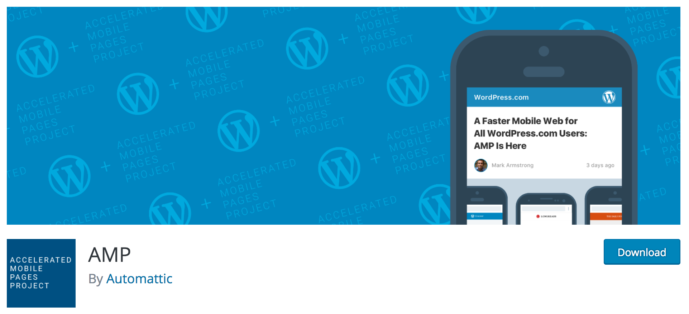

# [fit] We installed: https://en-gb.wordpress.org/plugins/amp/

---

# [fit] Step 2
# [fit] Tweak plugin 🔧

---

# [fit] Modifying output

We use Timber (Twig) and a semi-custom page builder to build pages (We do not use the default WordPress editor).

Fixing this was actually very easy thanks to the dedicated AMP page templates 📄

---

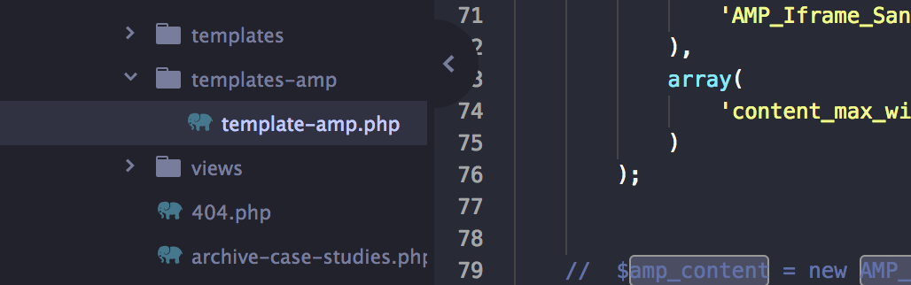

---

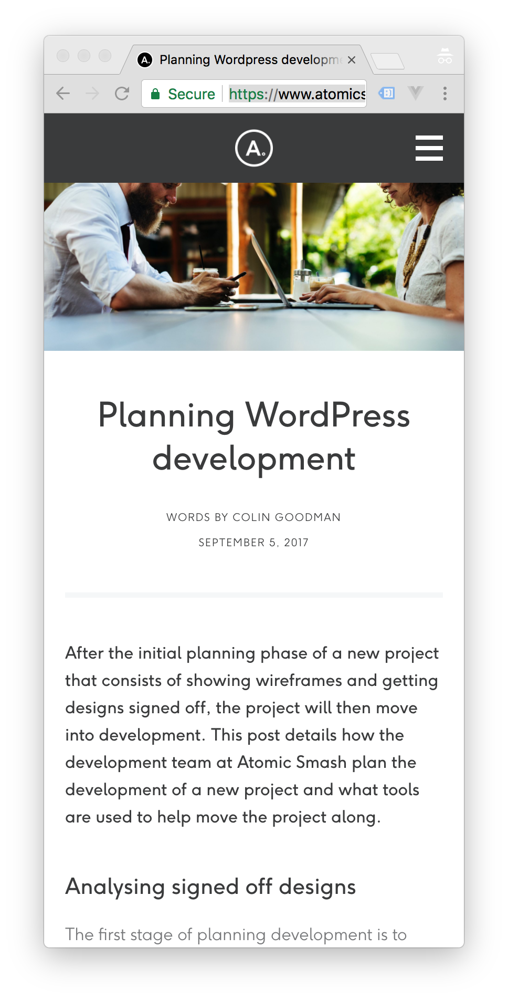

---

# [fit] atomicsmash.co.uk/planning-wordpress-development

---

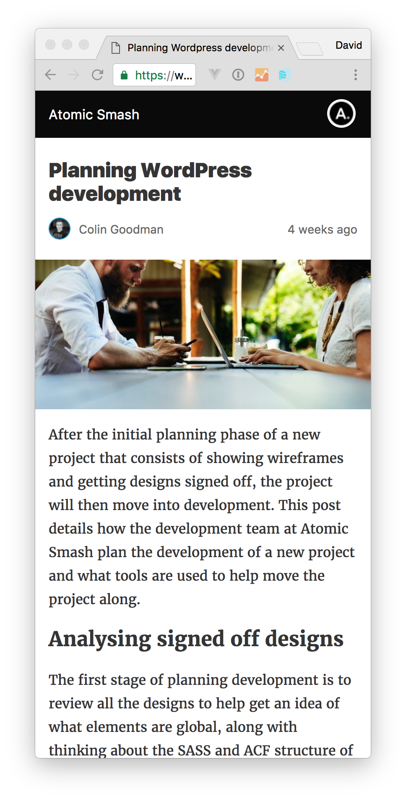

---

# [fit] atomicsmash.co.uk/planning-wordpress-development**/amp**

---

---

# [fit] Step 3
# [fit] Testing AMP plages 🤓

---

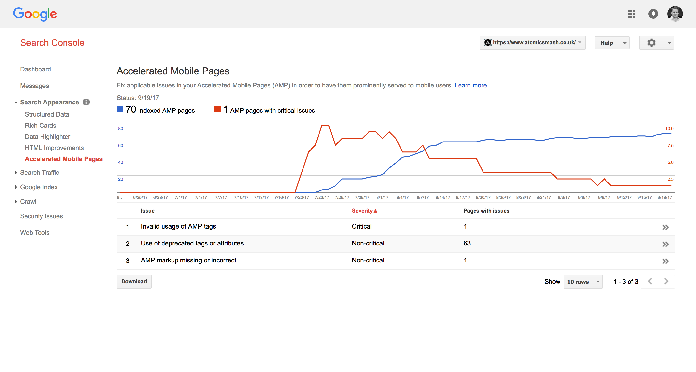

---

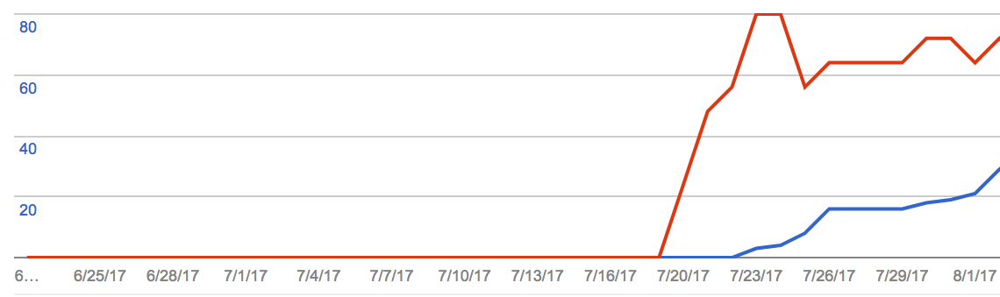

---

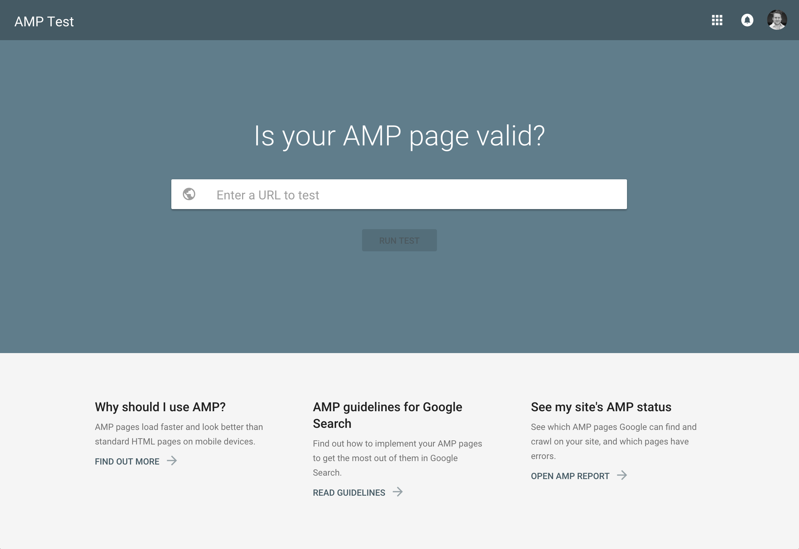

---

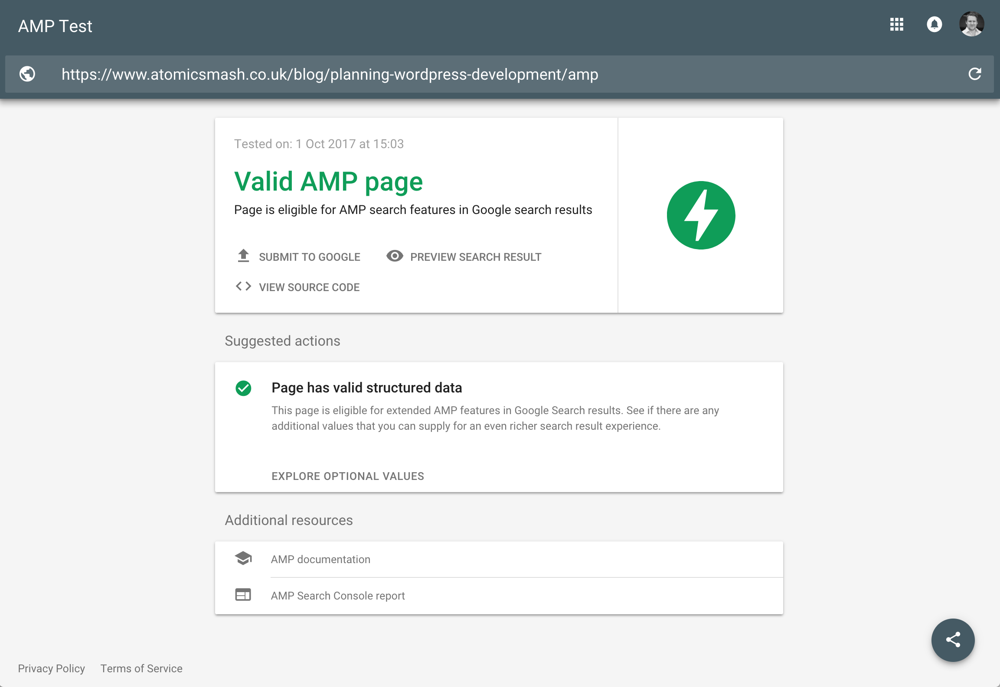

---

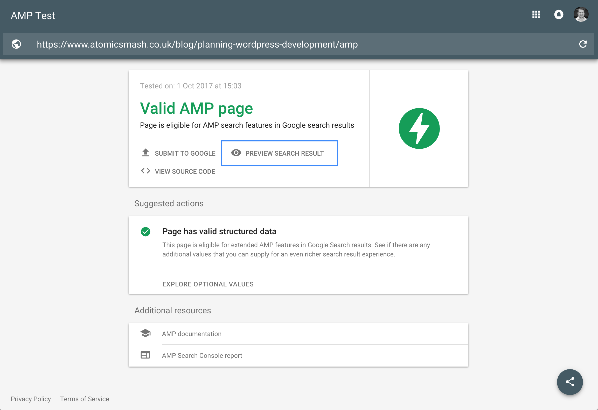

---

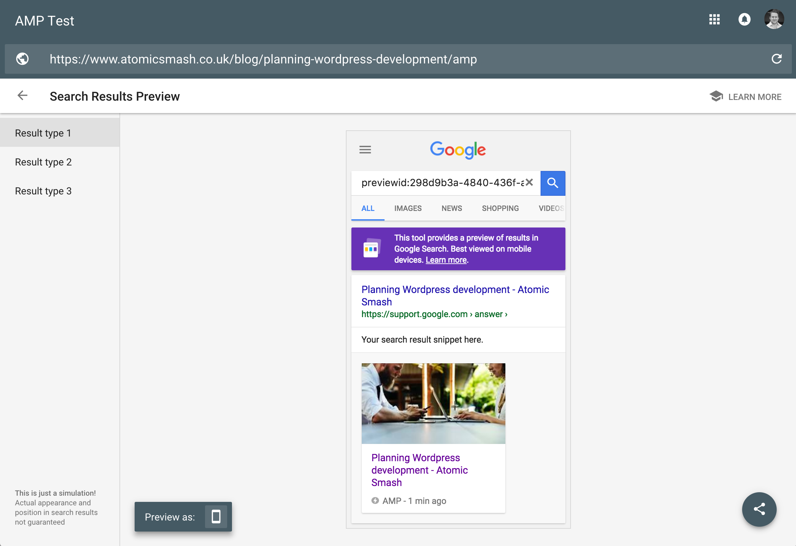

---

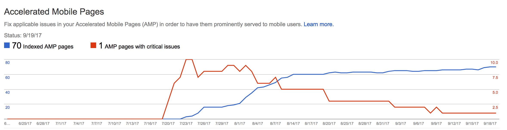

---

# [fit] Was this worth the time invested? 🤔

Maybe 😬. **Our** site doesn't host the right content.

---

# [fit] Should **you** use AMP? 🤔
YES!!! If **your** site does host the right content.

---

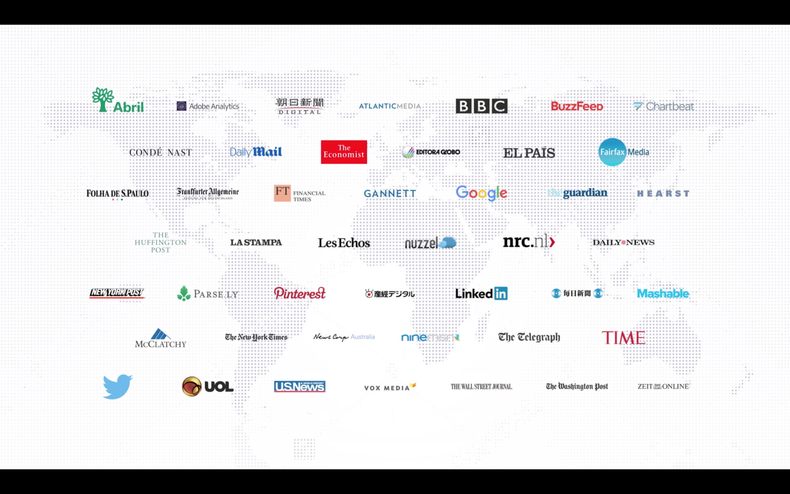

---

# [fit] Should **you actually** use AMP for
# [fit] the sake of using a new technology? 🤔

---

# [fit] Future of AMP ⏱

Features |
:-----------: |
Newer types of interactions |
Including e-commerce templates and crawling |
Better cache control |
More AMP consumers |
More supported Ad Networks |

---

# [fit] THANKS! ☺️

Follow me:
@david_darke

Follow my studio:
@atomicsmash

Get presentation here:
https://github.com/daviddarke/getting-amped

---

# [fit] Any questions? 🙋 🙋‍♂️

[^1]: Taken from https://www.youtube.com/watch?v=WrpkFROqR0Q
